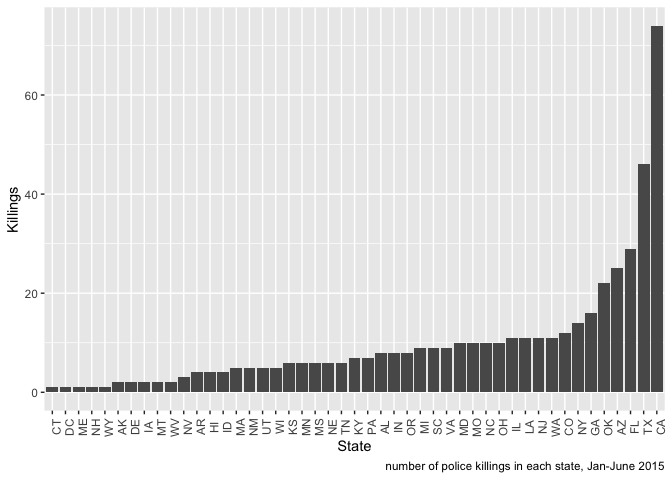
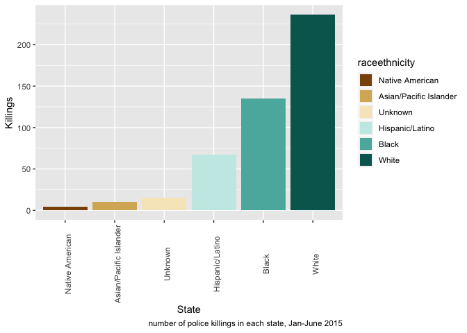
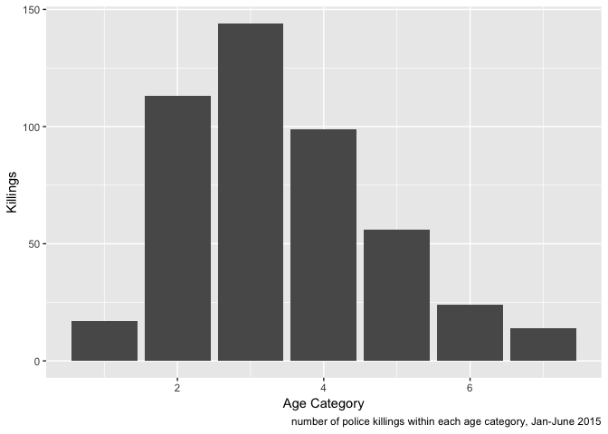
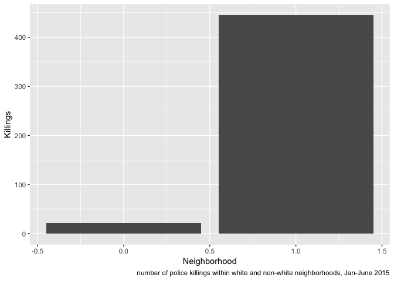
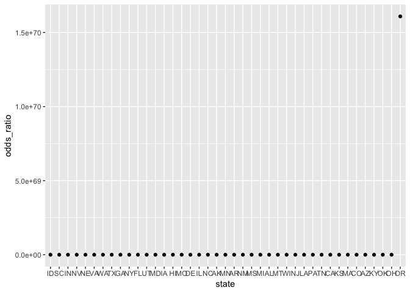
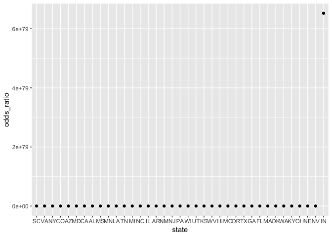

Chirag’s Exploration
================
Chirag Shah
2018-12-06

Time to do some exploration!

``` r
homicides_data = read_csv("https://raw.githubusercontent.com/fivethirtyeight/data/master/police-killings/police_killings.csv") %>%
  janitor::clean_names()
```

    ## Parsed with column specification:
    ## cols(
    ##   .default = col_character(),
    ##   day = col_integer(),
    ##   year = col_integer(),
    ##   latitude = col_double(),
    ##   longitude = col_double(),
    ##   state_fp = col_integer(),
    ##   county_fp = col_integer(),
    ##   tract_ce = col_integer(),
    ##   geo_id = col_double(),
    ##   county_id = col_integer(),
    ##   pop = col_integer(),
    ##   h_income = col_integer(),
    ##   county_income = col_integer(),
    ##   comp_income = col_double(),
    ##   county_bucket = col_integer(),
    ##   nat_bucket = col_integer(),
    ##   urate = col_double(),
    ##   college = col_double()
    ## )

    ## See spec(...) for full column specifications.

``` r
homicides_data = homicides_data %>%
  mutate(month = factor(month, levels = c("January", "February", "March", "April", "May", "June", "July", "August", "September", "October", "November", "December")),
         year = as.integer(year))

homicides_data %>%
  group_by(state) %>%
  summarise(total_killed = n()) %>%
  mutate(state = forcats::fct_reorder(state, total_killed)) %>%
  ggplot(aes(x = state, y = total_killed)) +
  geom_col(size = 3) +
  labs(x = "State", y = "Killings", 
       caption = "number of police killings in each state, Jan-June 2015") +
  theme(axis.text.x = element_text(angle = 90))
```



``` r
homicides_data %>%
  group_by(state) %>%
  summarise(total_killed = n()) %>%
  summarise(mean_killed = mean(total_killed)) %>% 
  mutate(std_error = stderr()) %>% 
  mutate(upper_bound = mean_killed + 1.96 * std_error,
         lower_bound = mean_killed - 1.96 * std_error)
```

    ## # A tibble: 1 x 4
    ##   mean_killed std_error upper_bound lower_bound
    ##         <dbl>     <int>       <dbl>       <dbl>
    ## 1        9.94         2        13.9        6.02

``` r
homicides_data %>%
  group_by(raceethnicity) %>%
  summarise(total_killed = n()) %>%
  mutate(raceethnicity = forcats::fct_reorder(raceethnicity, total_killed)) %>%
  ggplot(aes(x = raceethnicity, y = total_killed, fill = raceethnicity)) +
  geom_col(size = 3) +
  labs(x = "State", y = "Killings", 
       caption = "number of police killings in each state, Jan-June 2015") +
  theme(axis.text.x = element_text(angle = 90)) +
  scale_fill_brewer(palette = "BrBG")
```



``` r
homicides_data %>% 
mutate(agecat = ifelse(age %in% 0:18, 1, ifelse(age %in% 19:28, 2, ifelse(age %in% 29:38, 3, ifelse(age %in% 39:48, 4, ifelse(age %in% 49:58, 5, ifelse(age %in% 59:68, 6, 7))))))) %>% 
  group_by(agecat) %>%
  summarise(total_killed = n()) %>%
  ggplot(aes(x = agecat, y = total_killed)) +
  geom_col(size = 3) +
  labs(x = "Age Category", y = "Killings", 
       caption = "number of police killings within each age category, Jan-June 2015")
```



Regression

``` r
homicides_data %>% 
mutate(share_white = as.numeric(share_white)) %>% 
mutate(neighborhood = ifelse(share_white %in% 50:100, 0, 1)) %>% 
  ##0 represents a majority white neighborhood, 1 represents a majority other race neighborhood
  group_by(neighborhood) %>%
  summarise(total_killed = n()) %>%
  ggplot(aes(x = neighborhood, y = total_killed)) +
  geom_col(size = 3) +
  labs(x = "Neighborhood", y = "Killings", 
       caption = "number of police killings within white and non-white neighborhoods, Jan-June 2015")
```

    ## Warning in evalq(as.numeric(share_white), <environment>): NAs introduced by
    ## coercion



``` r
state_models = homicides_data %>% 
  mutate(share_white = as.numeric(share_white)) %>% 
  mutate(neighborhood = ifelse(share_white %in% 50:100, 0, 1)) %>% 
  ##0 represents a majority white neighborhood, 1 represents a majority other race neighborhood
  mutate(cause_cat = ifelse(cause == "gunshot", 1, 0)) %>% 
  ##1 represents gunshot, 0 represents other 
  mutate(armed_cat = ifelse(armed == "Firearm", 1, 0)) %>% 
  ##1 represents armed with Firearm, 0 represents armed with other or unarmed
  mutate(p_income = as.numeric(p_income)) %>%
  mutate(thousands_p_income = p_income/10000) %>% 
  group_by(state) %>% 
  ##group by state because we want each distinct city to have a model
  nest() %>% 
    mutate(logit_neighborhood = map(data, ~glm(neighborhood ~ cause_cat + armed_cat + thousands_p_income, family = binomial, data = .x)), 
         logit_neighborhood = map(logit_neighborhood, broom::tidy)) %>% 
  select(-data) %>% 
  unnest() %>% 
  ##using nest and unnest to map the model for all distinct cities in the dataset
  mutate(odds_ratio = exp(estimate), 
         lower_bound = exp(estimate - 1.96*std.error), 
         upper_bound = exp(estimate + 1.96*std.error))
```

    ## Warning in evalq(as.numeric(share_white), <environment>): NAs introduced by
    ## coercion

    ## Warning in evalq(as.numeric(p_income), <environment>): NAs introduced by
    ## coercion

    ## Warning: glm.fit: fitted probabilities numerically 0 or 1 occurred

    ## Warning: glm.fit: fitted probabilities numerically 0 or 1 occurred

    ## Warning: glm.fit: fitted probabilities numerically 0 or 1 occurred

    ## Warning: glm.fit: fitted probabilities numerically 0 or 1 occurred

    ## Warning: glm.fit: algorithm did not converge

    ## Warning: glm.fit: fitted probabilities numerically 0 or 1 occurred

    ## Warning: glm.fit: algorithm did not converge

    ## Warning: glm.fit: fitted probabilities numerically 0 or 1 occurred

``` r
  ##defining odds ratio and upper and lower bounds for the 95% confidence interval
```

``` r
state_models %>% 
  filter(term == "thousands_p_income") %>% 
  ##selecting the parameter we want
  select(odds_ratio, lower_bound, upper_bound, state) %>% 
  mutate(state = forcats::fct_reorder(state, odds_ratio)) %>% 
  ##ordering by city_state
  ggplot(aes(x = state, y = odds_ratio)) + 
  geom_point() 
```



``` r
  ##+ geom_errorbar(aes(ymin = lower_bound, ymax = upper_bound)) + 
  ##adding error bars to each odds ratio to show the 95% confidence interval for the odds ratio
  labs(title = "OR's for being killed in a majority other race neighborhood for a ten thousand dollar increase in average personal income", 
       y = "Odds ratio", 
       x = "State") +
  theme(axis.text.x = element_text(angle = 90))
```

    ## NULL

``` r
state_models %>% 
  filter(term == "armed_cat") %>% 
  ##selecting the parameter we want
  select(odds_ratio, lower_bound, upper_bound, state) %>% 
  mutate(state = forcats::fct_reorder(state, odds_ratio)) %>% 
  ##ordering by city_state
  ggplot(aes(x = state, y = odds_ratio)) + 
  geom_point() 
```



``` r
  ##+ geom_errorbar(aes(ymin = lower_bound, ymax = upper_bound)) + 
  ##adding error bars to each odds ratio to show the 95% confidence interval for the odds ratio
  labs(title = "OR's for being killed in a majority other race neighborhood for those who were armed with a firearm compared to those armed with other items or unarmed", 
       y = "Odds ratio", 
       x = "State") +
  theme(axis.text.x = element_text(angle = 90))
```

    ## NULL

Doesn't seem like there is enough power to have any substantial results. Upper and lower bounds routinely range from 0 to infinity.

Therefore create model for overall data irrespective of state.

``` r
america_model = homicides_data %>% 
  mutate(share_white = as.numeric(share_white)) %>% 
  mutate(neighborhood = ifelse(share_white %in% 50:100, 0, 1)) %>% 
  ##0 represents a majority white neighborhood, 1 represents a majority other race neighborhood
  mutate(cause_cat = ifelse(cause == "gunshot", 1, 0)) %>% 
  ##1 represents gunshot, 0 represents other 
  mutate(armed_cat = ifelse(armed == "Firearm", 1, 0)) %>% 
  ##1 represents armed with Firearm, 0 represents armed with other or unarmed
  mutate(p_income = as.numeric(p_income)) %>%
  mutate(thousands_p_income = p_income/10000) %>% 
  glm(neighborhood ~ cause_cat + armed_cat + thousands_p_income, family = binomial, data = .)
```

    ## Warning in evalq(as.numeric(share_white), <environment>): NAs introduced by
    ## coercion

    ## Warning in evalq(as.numeric(p_income), <environment>): NAs introduced by
    ## coercion

``` r
##glm(solved ~ victim_sex + victim_race + victim_age, family = binomial, data = .)

broom::tidy(america_model) %>% 
  ##tidying data
  mutate(odds_ratio = exp(estimate), 
         lower_bound = exp(estimate - 1.96*std.error), 
         upper_bound = exp(estimate + 1.96*std.error)) %>% 
  ##defining odds ratio, and upper and lower bounds of the confidence interval
  select(odds_ratio, lower_bound, upper_bound) %>% 
  knitr::kable(digits = 3)
```

|  odds\_ratio|  lower\_bound|  upper\_bound|
|------------:|-------------:|-------------:|
|       23.230|         6.717|        80.344|
|        2.118|         0.846|         5.300|
|        0.836|         0.544|         1.287|

In this model, the range between the upper and lower bounds encompass the null value of 1, thus we cannot say that there is a difference in being killed in a neighborhood that is majority non-white among those who were armed with a firearm vs not armed with a firearm as well as with a $10000 increase in personal income, on average.
